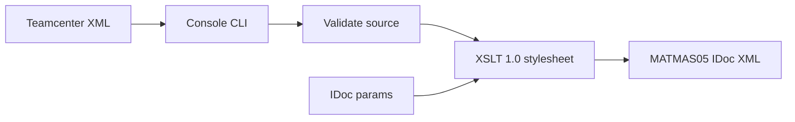

# Teamcenter to SAP MATMAS Converter

## Approach

  
I want a dotnet console application which will take an xml file defining a material master in siemens teamcenter format and convert it into SAP Idoc MatMas format, I want unit tests, I feel like xslt might be the best option unless you have a better suggestion

## Approach

XSLT is the right default for this job. The conversion is XML-to-XML, the mapping will change as real Teamcenter exports arrive, and .NET’s `XslCompiledTransform` (XSLT 1.0) is built-in, fast, and easy to golden-file test.

Use C# only for the host: CLI, file I/O, validation, and IDoc control-record parameters (timestamps, partner numbers). Do **not** introduce Saxon or XSLT 3.0 unless the mapping outgrows 1.0.

Because there are no customer samples yet, the first version will:

- Define a **documented representative Teamcenter source** based on a PLMXML Item / ProductRevision export (the usual file-based Teamcenter interchange), not MatML engineering-material XML and not a full proprietary TcXML dump.
- Emit **MATMAS05** with `EDI_DC40`, `E1MARAM` (basic data), and nested `E1MAKTM` (description). No plant, storage, sales, or classification segments in v1.

When a real Teamcenter file is available, only the XSLT XPath and value maps should need to change.




## Solution layout

New SDK-style solution targeting **net8.0**:

- [src/XmlTransformer.Core/XmlTransformer.Core.csproj](src/XmlTransformer.Core/XmlTransformer.Core.csproj) — transform engine
- [src/XmlTransformer.Cli/XmlTransformer.Cli.csproj](src/XmlTransformer.Cli/XmlTransformer.Cli.csproj) — console host
- [tests/XmlTransformer.Tests/XmlTransformer.Tests.csproj](tests/XmlTransformer.Tests/XmlTransformer.Tests.csproj) — xUnit
- [transforms/TeamcenterToMatmas05.xslt](transforms/TeamcenterToMatmas05.xslt) — mapping (copied to output)
- [samples/teamcenter-material.xml](samples/teamcenter-material.xml) — representative source
- [tests/XmlTransformer.Tests/Fixtures/](tests/XmlTransformer.Tests/Fixtures/) — input/expected XML used by tests

Keep dependencies small: `System.CommandLine` for the CLI, xUnit for tests. No extra XML libraries.

## Source contract (starter)

Representative PLMXML-shaped input (namespace `http://www.plmxml.org/Schemas/PLMXMLSchema`):

- `Product/@productId` or Item `itemId` → `MATNR`
- `Product/@name` or revision description → `MAKTX` (max 40 chars)
- `ProductRevision/@revision` → recorded in mapping comments; not a MATMAS basic-data field in v1
- `UserValue[@title='uom_tag']` → `MEINS`
- `UserValue[@title='object_type']` → `MTART` via lookup
- `UserValue[@title='material_group']` → `MATKL` when present
- `UserValue[@title='industry_sector']` → `MBRSH` when present

Include one sample with those properties filled in so the mapping is obvious and replaceable.

## Target IDoc (v1)

Root `MATMAS05` / `IDOC BEGIN="1"`:

- `EDI_DC40`: `TABNAM=EDI_DC40`, `DIRECT=2` (inbound), `IDOCTYP=MATMAS05`, `MESTYP=MATMAS`, plus sender/receiver partner fields and `CREDAT`/`CRETIM` passed in from C#
- `E1MARAM`: `MSGFN` (default `005` replace), `MATNR`, `MTART`, `MBRSH` (default `M`), `MEINS`, optional `MATKL`
- Nested `E1MAKTM`: `MSGFN`, `SPRAS` (default `E`), `MAKTX`, `SPRAS_ISO` (default `EN`)

Do not emit empty optional fields. Do not zero-pad `MATNR` (external number range). Map common UoM values to SAP ISO codes in the stylesheet (`each`/`EA` → `PCE`, `kg` → `KGM`) with passthrough otherwise.

Default type map in XSLT: `Item`/`Part` → `FERT`, `Material` → `ROH`, unknown → CLI `--material-type` default (`FERT`).

## Core + CLI

`XsltMaterialTransformer` in Core:

- Load stylesheet once
- Accept `TransformOptions` (input XML, stylesheet path, IDoc partner/date/doc-number parameters)
- Validate that a material number can be resolved **before** transform; throw a clear error if missing/invalid XML
- Return formatted UTF-8 XML

CLI usage:

```text
XmlTransformer convert <input.xml> [-o output.xml]
  [--sender-partner TCENT] [--receiver-partner SAPCLNT100]
  [--material-type FERT] [--industry-sector M]
```

If `-o` is omitted, write `<input>.matmas.xml` next to the source. Exit non-zero on validation/transform errors.

Use an `IClock` (or pass timestamps in) so tests can freeze `CREDAT`/`CRETIM`.

## Tests

xUnit tests against Core, not the console process:

- Golden-file happy path: fixture Teamcenter XML → expected MATMAS05 (fixed IDoc params; compare via normalized `XDocument`, ignoring insignificant whitespace)
- Type and UoM lookups
- Description truncated to 40 characters
- Missing material number / malformed XML → expected exception
- Optional `MATKL` omitted when absent in source
- CLI argument parsing can stay light; prefer Core tests

## Out of scope for v1

Plant (`E1MARCM`), storage, sales, classification, long texts, and posting into SAP. The stylesheet is the extension point for those later.